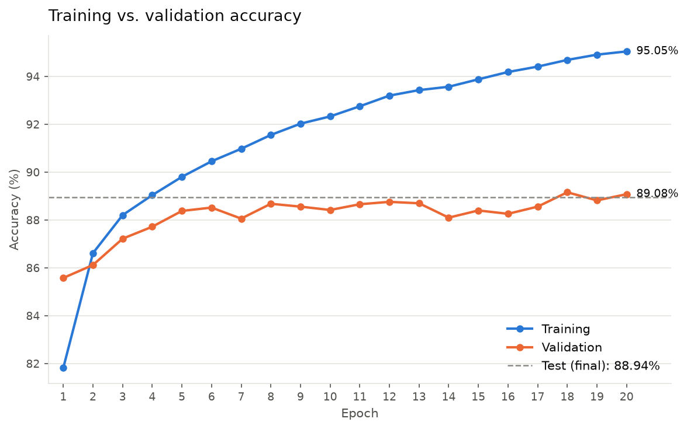

# Project Summary — Fashion MNIST MLP Classifier (PyTorch)

A summary of the full conversation used to build this project, for CSCI E-89 Homework 3.
The request-by-request log is in [`PROMPTS.md`](PROMPTS.md).

## Goal

Build an image classifier for Fashion MNIST in PyTorch, one Python file per major step,
each committed separately. Every file had to work both as a standalone script and when
pasted into a Jupyter Notebook cell, since the final deliverable includes a notebook
containing all of them. A running log of requests was kept in `PROMPTS.md`.

## How the conversation went

| # | Request | Outcome |
|---|---|---|
| 1 | Set up the project; write `data.py` | Download, seed 42, 55k/5k split, normalization, batch-32 DataLoaders. Also created `PROMPTS.md` and `.gitignore`. |
| 2 | Write `model.py` | MLP: 784 → 300 → 100 → 10 with ReLU; 266,610 parameters. |
| 3 | Write `train.py` | SGD (lr 0.1), cross-entropy, 20 epochs, torchmetrics accuracy. **Test accuracy 0.8894.** |
| 4 | Write `plot.py` | Chart of training vs. validation accuracy (`accuracy.png`), shown inline in Jupyter; called by `train.py`. |
| 5 | Write `predict.py` | Softmax probabilities and top-4 classes for the first 3 validation images; all 3 predicted correctly. |
| 6 | Tune with Optuna (10 trials × 5 epochs) | Best: lr 0.021, 150/75, momentum 0.18 → test **0.8850**, *below* the baseline. |
| 7 | Re-run tuning with 30 trials | Best: lr 0.050, 200/200, momentum 0.26 → test **0.8891**, essentially tied with the baseline. |
| 8 | Verify everything, one step at a time; write this summary | Every script re-run in sequence and reproduced its committed results exactly; all 6 files also ran as notebook cells in a real Jupyter kernel. |

## The pipeline

### `data.py`
- Sets seed 42 for Python, NumPy and PyTorch, with cuDNN in deterministic mode.
- Downloads Fashion MNIST via torchvision into `./data/` (git-ignored).
- Splits the 60,000 training images into **55,000 train / 5,000 validation**, using a seeded permutation.
- `ToTensor()` → float32 in [0, 1], then `Normalize` with the mean/std of the **training split only**
  (0.2856 / 0.3527), so no validation or test data leaks into preprocessing.
- DataLoaders with batch size 32. Only the training loader shuffles, using a seeded generator.
  `num_workers=0` avoids multiprocessing problems in Jupyter.
- Exposes `CLASS_NAMES` and `device` (CUDA → Apple MPS → CPU).

### `model.py`
- `MLPClassifier(nn.Module)`: Flatten → Linear(784, 300) → ReLU → Linear(300, 100) → ReLU → Linear(100, 10).
- Outputs raw logits; `CrossEntropyLoss` applies log-softmax itself.
- The hidden sizes are constructor arguments, which let the tuning step reuse the same class.

### `train.py`
- SGD (lr 0.1) and `CrossEntropyLoss` for 20 epochs.
- Accuracy uses torchmetrics `MulticlassAccuracy(average="micro")`, i.e. plain correct ÷ total.
  (torchmetrics defaults to `"macro"`, the average of per-class accuracies.)
- Records the mean training loss (weighted by batch size), training accuracy and validation accuracy each epoch
  in `history` and prints them.
- Evaluates on the test set, then saves `mlp_fashion_mnist.pt` and `history.json` (including `test_acc`),
  and calls `plot_history`.

### `plot.py`
- Training and validation accuracy on one chart, with the final test accuracy as a dashed reference line
  and end-of-line value labels. Uses colorblind-safe colors.
- Always saves `accuracy.png`. Calls `plt.show()` only inside a Jupyter kernel, so the chart appears inline there
  and a plain script doesn't block or warn.
- `python plot.py` redraws the chart from `history.json` without retraining.

### `predict.py`
- Loads the saved weights and runs the first 3 validation images as one batch.
- Prints predicted vs. true class, all 10 softmax probabilities (3 decimals) and the top-4 classes (`topk`).

### `tune.py`
- Optuna search over the learning rate (1e-5 to 1e-1, log scale), hidden layer 1 (50–500), hidden layer 2 (25–300)
  and SGD momentum (0–0.99). Uses a TPE sampler with seed 42 and a median pruner.
- **Speed:** each dataset is loaded into memory as one tensor on `device`, and batches are sliced from it.
  This skips the per-image conversion in the DataLoader. The data and batch size are identical, and a
  5-epoch trial takes seconds instead of close to a minute.
- Prints the trials table and best parameters, retrains the best configuration for 20 epochs and compares its test
  accuracy with the baseline. Saves `optuna_trials.csv`, `tuning_results.json`, `tuning_log.txt` and
  `mlp_fashion_mnist_tuned.pt`.

## Results

### Baseline (`train.py`)

| Epoch | Train loss | Train acc | Val acc |
|---|---|---|---|
| 1 | 0.4927 | 0.8182 | 0.8558 |
| 10 | 0.2020 | 0.9233 | 0.8842 |
| 20 | 0.1278 | 0.9505 | 0.8908 |

**Test accuracy: 0.8894.** Validation accuracy levels off around 88–89% after about epoch 8 while training
accuracy keeps rising to 95%, so the model starts to overfit.

### Predictions (`predict.py`)

| Image | True class | Predicted | Confidence | Runner-up |
|---|---|---|---|---|
| 0 | Sneaker | Sneaker ✓ | 0.999 | Ankle boot (0.000) |
| 1 | Coat | Coat ✓ | 0.995 | Pullover (0.005) |
| 2 | Pullover | Pullover ✓ | 0.987 | Shirt (0.013) |

Each second choice is a similar-looking item of clothing.

### Hyperparameter tuning (`tune.py`)

| Run | Best lr | Momentum | Hidden | Test acc | vs. baseline |
|---|---|---|---|---|---|
| Baseline | 0.1 | 0 | 300 / 100 | 0.8894 | — |
| Optuna, 10 trials | 0.0214 | 0.182 | 150 / 75 | 0.8850 | −0.44 pp |
| Optuna, 30 trials | 0.0496 | 0.258 | 200 / 200 | 0.8891 | −0.03 pp |

- With 10 trials, most samples used learning rates far below the baseline's. Only the fastest-learning trials
  reached ~87% in 5 epochs, which pointed to the top of the range.
- With 30 trials, the search settled on lr ≈ 0.02–0.1. The winner's effective step size (lr / (1 − momentum) ≈ 0.067)
  is close to the baseline's 0.1, so tuning mostly rediscovered the baseline.
- **Conclusion:** the baseline hyperparameters were already near-optimal for this search space. Around 89% is the
  practical ceiling for this MLP; going higher would take regularization (dropout, weight decay) or a CNN, which
  usually reaches 91–93% on Fashion MNIST.

## Verification (final step)

As requested, each check ran on its own, one after another:

1. `python data.py`: correct split sizes, batch shape `(32, 1, 28, 28)` and dtype float32.
2. `python model.py`: 266,610 parameters, output shape `(32, 10)`.
3. `python train.py`: full 20 epochs. Every number matched the original run, and the regenerated
   weights, `history.json` and `accuracy.png` were **byte-identical** to the committed ones.
4. `python plot.py`: redrew the chart from `history.json`; the file was unchanged.
5. `python predict.py`: same predictions and probabilities as before.
6. `python tune.py`: full 30-trial search and retrain. The output matched the committed `tuning_log.txt` except for timing.
7. **Notebook check:** all six files, pasted as cells in the order
   `data → model → plot → train → predict → tune`, ran in a real Jupyter kernel (via `nbclient`) with **no errors**.
   The accuracy chart appeared inline after training. This check used shorter epoch and trial counts to save time,
   since the full-length runs had just been verified.

## Design decisions worth noting

- **Works as a script or a notebook cell.** No command-line arguments and no relative imports. Each file first
  uses variables from earlier cells (`try: train_loader ... except NameError: from data import ...`),
  so it runs either way.
- **Notebook cell order:** `plot.py` must come **before** `train.py`, because training calls `plot_history`.
- **Reproducibility:** fixed seeds for the split, weight initialization, shuffling and the Optuna sampler.
  Re-runs reproduce the results exactly on CPU.
- **No leakage:** normalization statistics come from the training split only; the test set is used only
  for final evaluation.
- **Committed outputs:** trained weights (~1 MB and ~0.5 MB), histories, the plot and the tuning results are all
  in git, so later steps and the notebook don't need to retrain. The raw dataset is git-ignored.

## Files

| File | Purpose |
|---|---|
| `data.py` | Download, split, normalize, DataLoaders |
| `model.py` | `MLPClassifier` definition |
| `train.py` | Baseline training, test evaluation, saving, plotting |
| `plot.py` | Accuracy chart (PNG and inline in Jupyter) |
| `predict.py` | Softmax / top-4 predictions on 3 validation images |
| `tune.py` | Optuna hyperparameter search and retraining |
| `mlp_fashion_mnist.pt`, `history.json`, `accuracy.png` | Baseline outputs |
| `mlp_fashion_mnist_tuned.pt`, `tuning_results.json`, `optuna_trials.csv`, `tuning_log.txt` | Tuning outputs (30 trials) |
| `PROMPTS.md` | Log of every request |
| `SUMMARY.md` | This summary |
